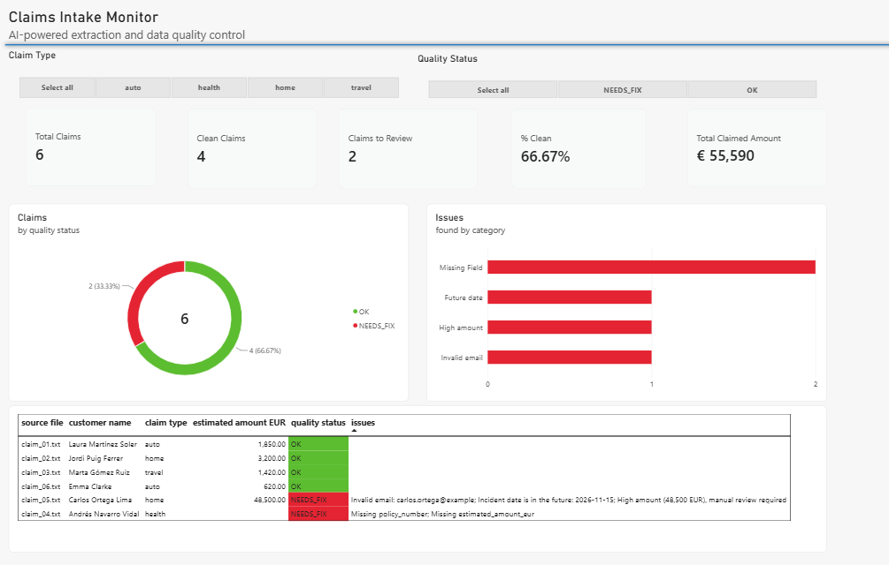
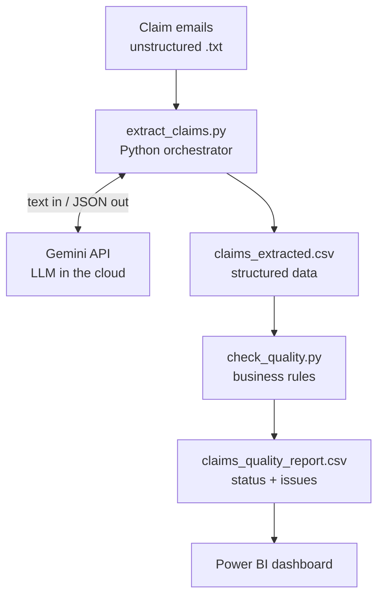

# Claims Intake Monitor: AI Extraction & Data Quality Control

An end-to-end automation pipeline that reads unstructured insurance claim emails, extracts structured data with a Large Language Model (LLM), validates it with business rules, and presents the results in a Power BI dashboard.



> All claim documents in this project are **fictional** and were created for demonstration purposes.

---

## The problem

Insurance companies receive many claims as free-text emails. Each one is written differently, sometimes in different languages, and some are incomplete. Normally, a person reads every email and types the data into a system by hand, which is slow, repetitive and error-prone.

## The solution

This pipeline automates the intake process:

1. **An LLM reads each email** and extracts the key fields into a structured format.
2. **Business rules validate the result**, flagging missing data, invalid values and suspicious claims.
3. **A Power BI dashboard** shows the overall quality and highlights which claims need human review.

The key design principle: **the AI is used only for what it does best (understanding language), while everything that must be auditable is handled by deterministic rules.**

---

## Architecture



| Component | Purpose |
|---|---|
| `sample_claims/` | Six fictional claim emails in Spanish and English, with different styles and deliberate data problems |
| `extract_claims.py` | Sends each email to the LLM and saves the extracted fields to a CSV |
| `check_quality.py` | Applies validation rules and assigns a quality status to every claim |
| `claims_dashboard.pbix` | Power BI dashboard built on the quality report |

## Tech stack

**Python** · **Google Gemini API (LLM)** · **pandas** · **Power BI** (Power Query, DAX) · **Git**

---

## How it works

### 1. AI extraction (`extract_claims.py`)

Each email is sent to the Gemini LLM with a system prompt that defines exactly which fields to extract:

`policy_number` · `customer_name` · `incident_date` · `claim_type` · `description_summary` · `estimated_amount_eur` · `contact_email`

How the AI is controlled:
- **Strict instructions:** the model must never invent values and must return `null` when information is missing, which is essential in a regulated industry.
- **Structured output:** the model is forced to answer in JSON, so the result can be processed directly.
- **Temperature 0:** consistent, non-creative answers.

Production-style reliability:
- **Retry with backoff** for temporary server errors (500, 503).
- **Quota detection:** stops immediately when the API limit is reached, instead of wasting requests.
- **Resumable runs:** documents already extracted are skipped, so a re-run only processes what failed.

### 2. Data quality checks (`check_quality.py`)

| Rule | What it checks |
|---|---|
| Completeness | All required fields are present |
| Policy format | Policy number follows the pattern `XXX-YYYY-NNNNNN` |
| Policy vs. type | Policy prefix matches the claim type (e.g. `AUT` = auto, `HOG` = home) |
| Email | Valid email format |
| Incident date | Readable and not in the future |
| Amount | Positive; above 20,000 EUR it is flagged for manual review |

Each claim receives a status: **OK**, **REVIEW** (warnings only), **NEEDS_FIX** (real problems) or **NOT_EXTRACTED**.

### 3. Dashboard (Power BI)

KPIs, claims by quality status, issues by category, and a detail table with conditional formatting. Issues are split into categories in Power Query, and the dashboard refreshes directly from the pipeline output.

---

## Results

| Metric | Value |
|---|---|
| Claims processed | 6 / 6 |
| Clean claims | 4 (66.7%) |
| Claims sent to review | 2 |

What the pipeline handled correctly:
- Emails in **Spanish and English**, from formal letters to informal messages.
- Amounts in different formats (`1.850 euros`, `3.200 €`, `€620`) converted to clean numbers.
- **No invented data:** a claim with no amount or policy number was left empty and flagged, not guessed.
- One claim was flagged for **three issues at once**: an invalid email, an incident date in the future, and an unusually high amount (48,500 EUR). In real insurance work, this combination would trigger a fraud review.

---

## Project structure

```
claims-ai-automation/
├── sample_claims/              # fictional claim emails (input)
├── output/
│   ├── claims_extracted.csv    # extracted data
│   └── claims_quality_report.csv
├── images/
│   └── dashboard.png
├── extract_claims.py           # step 1: AI extraction
├── check_quality.py            # step 2: quality rules
├── test_api.py                 # connection test
├── claims_dashboard.pbix       # Power BI dashboard
├── requirements.txt
└── .env.example                # template for the API key
```

## How to run it

```bash
# 1. Clone the repository and create a virtual environment
git clone https://github.com/adelinagjoka/claims-ai-automation.git
cd claims-ai-automation
python -m venv venv
venv\Scripts\activate            # Windows  (macOS/Linux: source venv/bin/activate)

# 2. Install the dependencies
pip install -r requirements.txt

# 3. Add your API key
#    Copy .env.example to .env and paste your free Gemini API key
#    (get one at https://aistudio.google.com)

# 4. Run the pipeline
python extract_claims.py
python check_quality.py
```

Then open `claims_dashboard.pbix` in Power BI Desktop and click **Refresh**.

---

## Possible next steps

- Read PDF attachments and scanned documents, not only email text.
- Add a human-in-the-loop step where reviewers correct flagged claims.
- Schedule the pipeline to run automatically when new emails arrive.
- Compare the accuracy of different LLMs on a larger labeled dataset.

---

## Author

**Adelina Gjoka**: Data Analyst | BI, Data Governance & AI Automation | Insurance & Banking

[LinkedIn](https://www.linkedin.com/in/adelina-gjoka11) · [GitHub](https://github.com/adelinagjoka)
