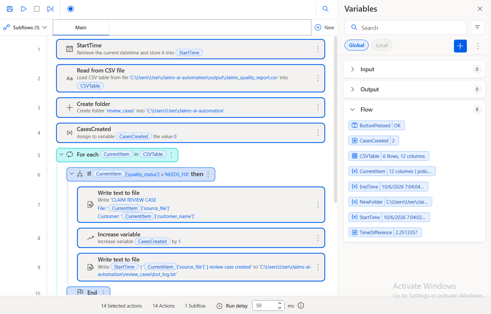
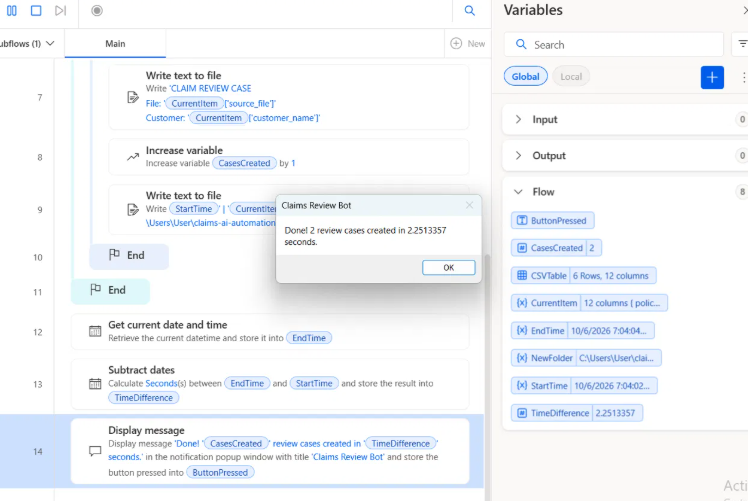

# Claims Review Bot (RPA with Power Automate Desktop)

An RPA bot that picks up where the Python pipeline ends: it reads the quality report and opens a review case for every claim that needs human attention.

## What it does

1. Starts a timer to measure the run.
2. Reads `output/claims_quality_report.csv` (produced by `check_quality.py`).
3. Loops through every claim and, for each one with status **NEEDS_FIX**:
   - creates a review case file (`review_cases/review_<claim>.txt`) with the customer, claim type, amount and issues found;
   - adds a line to an audit log (`review_cases/bot_log.txt`);
   - increases a case counter.
4. Stops the timer and reports how many cases were created and how long it took.

## Result and impact

| Metric | Value |
|---|---|
| Claims checked | 6 |
| Review cases created | 2 |
| Bot run time | ~2 seconds |

If opening a review case by hand takes about 5 minutes, 500 flagged claims a month would take ~40 hours of manual work. The bot does it in seconds, consistently, and leaves an audit log of every case it created.

## Design choices

- **Works on the pipeline's output:** the bot depends only on the quality report, so the AI extraction, the rules and the RPA step can evolve independently.
- **Traceability:** every action is written to a log, which matters in regulated environments like insurance.
- **Built-in KPI:** the bot measures its own run time and case count, so its value can be monitored.

## How to use it

1. Open **Power Automate Desktop** (free on Windows) and create a new flow.
2. Open `claims_review_bot.txt`, copy all its content, and paste it into the empty flow (Ctrl + V). The actions appear automatically.
3. Adjust the folder paths if your project lives somewhere other than `C:\Users\User\claims-ai-automation`.
4. Run `extract_claims.py` and `check_quality.py` first, then run the bot.
